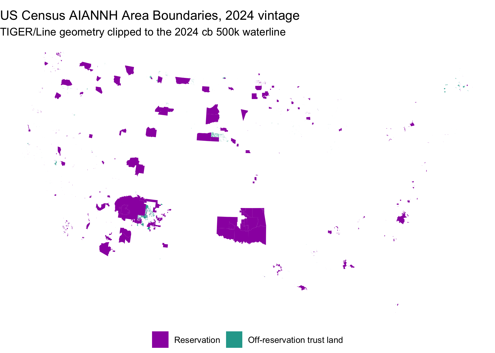

[](https://github.com/sustainable-fsa/census-aiannh)

This repository archives **vintage-matched US Census American Indian /
Alaska Native / Native Hawaiian (AIANNH) Area boundaries** for the
[Sustainable FSA](https://sustainable-fsa.com) project. Each annual
TIGER/Line vintage is archived as published, again clipped to the same
year’s cartographic waterline for display, and in three derived display
formats — TopoJSON, FlatGeobuf, and PMTiles.

## 📦 Dataset Overview

- **Title:** Vintage-Matched US Census AIANNH Area Boundaries
- **Source:** U.S. Census Bureau TIGER/Line and Cartographic Boundary
  files
- **Format:** GeoParquet (ZSTD-13), EPSG:4269 (NAD83), plus derived
  TopoJSON, FlatGeobuf, and PMTiles
- **Vintages:** 2000, 2007, 2008, 2009, 2010, and 2011–2025 (20 in all)
- **Extent:** federally and state-recognized American Indian
  reservations and off-reservation trust lands, Alaska Native areas, and
  Hawaiian home lands — 920 distinct area components, 16,468
  component-vintages (734 to 867 per vintage)
- **Distribution Type:** Public archival for research and historical
  purposes

## 📂 Contents

This repository is a
[BagIt](https://datatracker.ietf.org/doc/html/rfc8493) archive,
following the same layout as the
[`census-counties`](https://github.com/sustainable-fsa/census-counties)
and [`usdm`](https://github.com/sustainable-fsa/usdm) archives of
record:

    census-aiannh/
    ├── bagit.txt, bag-info.txt, manifest-sha256.txt
    ├── census-aiannh.parquet                     every clipped vintage, stacked
    ├── census-aiannh-manifest.json               path, size and sha256 of each file
    └── data/
        ├── raw/tl_<year>_us_aiannh.zip           Census downloads, verbatim
        ├── parquet/<year>-aiannh.parquet         raw TIGER/Line
        ├── clipped/<year>-aiannh.parquet         cut at that vintage's waterline
        ├── topojson/<year>-aiannh.topojson       display: quantized topology, WGS84
        ├── flatgeobuf/<year>-aiannh.fgb          display/streaming: indexed, NAD83
        ├── pmtiles/<year>-aiannh.pmtiles         display: vector tiles, layer "aiannh"
        └── quality/geometry_validation.csv       what enforcing validity changed

- [`data/parquet/<year>-aiannh.parquet`](https://data.sustainable-fsa.com/census-aiannh/)
  – raw TIGER/Line AIANNH areas, exactly as Census published them. 20
  files, about 7 MB each.
- [`data/clipped/<year>-aiannh.parquet`](https://data.sustainable-fsa.com/census-aiannh/)
  – the same geometries, cut at that vintage’s `cb` 500k waterline.
  About 7 MB each.
- [`data/topojson/`, `data/flatgeobuf/`,
  `data/pmtiles/`](https://data.sustainable-fsa.com/census-aiannh/) –
  the clipped form again, as web-display formats. See [Derived Display
  Formats](#-derived-display-formats).
- [`census-aiannh.parquet`](https://data.sustainable-fsa.com/census-aiannh/census-aiannh.parquet)
  – all 20 clipped vintages in one file, 16,468 rows, sorted by `GEOID`
  then `year`. 15 MB.
- [`data/quality/geometry_validation.csv`](https://data.sustainable-fsa.com/census-aiannh/data/quality/geometry_validation.csv)
  – a per-feature record of every geometry the build altered while
  enforcing validity.
- [`_manifest.txt`](https://data.sustainable-fsa.com/census-aiannh/_manifest.txt)
  – flat index of every file in the S3-hosted mirror.

`census-aiannh.parquet` is sorted by `GEOID` then `year` so an area’s
whole history is contiguous. Reading one vintage is better served by
that vintage’s own file in `data/clipped/`.

The raw downloads keep their Census filenames, so 2000 and 2010 are
`tl_2010_us_aiannh00.zip` and `tl_2010_us_aiannh10.zip` (both published
inside TIGER2010), and 2007 is `fe_2007_us_aiannh.zip` (the TIGER First
Edition release).

## 🧾 Field Descriptions

TIGER splits some entities into separate **reservation** and
**off-reservation trust land** features, and this archive keeps that
split: the unit of the archive is the area *component*, identified by
`GEOID`.

| Field Name | Description |
|----|----|
| `GEOID` | The five-character area component identifier: `AIANNHCE` plus an `R`/`T` component suffix where an entity splits. The stable key across vintages |
| `AIANNHCE` | The four-digit Census AIANNH area code |
| `GNIS` | The eight-digit ANSI/GNIS code (`AIANNHNS`). **`NA` throughout the 2000 and 2007 vintages** — 2000 predates the field, and the 2007 First Edition file carries it unpopulated |
| `Name` | The area name |
| `NameLSAD` | The area name with its legal/statistical area description |
| `LSAD` | The legal/statistical area description code |
| `COMPTYP` | The component type as published by Census: `R` (reservation), `T` (off-reservation trust land) |
| `year` | The TIGER/Line vintage the geometry comes from |
| `mask_year` | The `cb` vintage whose waterline clipped that vintage (clipped and stacked forms only). One value per vintage |

## 🌊 Why Both Raw and Clipped

TIGER/Line (`tl_`) AIANNH boundaries are the legal ones, and they are
what the weekly USDM aggregations in
[`usdm-aiannh`](https://github.com/native-resilience/usdm-aiannh) are
computed against. So `tl` is the analytical truth, and this archive
keeps it unaltered.

But `tl` does not stop at water. Coastal reservations and Alaska Native
areas extend offshore — correct as a legal boundary, and misleading as a
picture. The clipped form exists so a map can show an area’s land
without implying that the water belongs to it. It is **derived, never
authoritative**.

## 🗺️ Derived Display Formats

Three more forms of the clipped layer, one per vintage, for consumers
that want something other than GeoParquet. All three are **derived,
never authoritative**, and none is ever read back into the pipeline — a
one-way flow that matters, because TopoJSON quantization is a coordinate
snap and snapping introduces exactly the invalidity the rest of the
build works to remove. A display artifact at the end of the line can
afford that; an input cannot.

- **TopoJSON** (`data/topojson/`) — quantized shared-arc topology
  (`quantization=1e6`, `fix-geometry`, as in the org’s
  `fsa-counties-dd17`/`dd22` repos), WGS84 by format convention. The
  layer is named `aiannh`.
- **FlatGeobuf** (`data/flatgeobuf/`) — a lossless, spatially indexed
  copy of the clipped layer, EPSG:4269 like the parquet. Suits HTTP
  range-request streaming of bounding-box subsets.
- **PMTiles** (`data/pmtiles/`) — tippecanoe vector tiles in a single
  static file, layer `aiannh`, zoom range chosen from feature density.
  Serves straight from the CDN over HTTP range requests; no tile server.

To put a vintage on a MapLibre map:

``` js
// npm: pmtiles maplibre-gl
import { Protocol } from "pmtiles";
maplibregl.addProtocol("pmtiles", new Protocol().tile);

map.addSource("aiannh", {
  type: "vector",
  url: "pmtiles://https://data.sustainable-fsa.com/census-aiannh/data/pmtiles/2024-aiannh.pmtiles"
});
map.addLayer({
  id: "aiannh-fill",
  type: "fill",
  source: "aiannh",
  "source-layer": "aiannh",
  paint: { "fill-color": "#9c27b0", "fill-opacity": 0.4 }
});
```

## 📅 The Clip Mask Matches the Vintage

Cutting 2012 land with a 2024 coastline produces a boundary belonging to
neither year. Each vintage is therefore clipped with a waterline built
from the cartographic boundary (`cb`) 500k **county** file of the same
year — counties tile the nation, so their union is the national
landmass.

Census does not publish a `cb` file for every vintage. Measured against
`www2.census.gov`:

| Vintage | `cb` 500k county file |
|----|----|
| 2010 | `GENZ2010/gz_2010_us_050_00_500k.zip` |
| 2013 | `GENZ2013/cb_2013_us_county_500k.zip` |
| 2014–2025 | `GENZ<year>/shp/cb_<year>_us_county_500k.zip` |
| 2000, 2007, 2008, 2009, 2011, 2012 | none published — nearest used (2010, or 2013 for 2012) |

The fallback year is recorded per row in `mask_year`, so a reader can
see which coastline was used rather than reconstruct it. Unlike
[`census-counties`](https://github.com/sustainable-fsa/census-counties),
the mask is never composite: no AIANNH area lies in the four island
territories that `cb` 2010 misses, so every vintage carries a single
`mask_year` throughout.

The mask only ever changes the coast. Inland boundaries keep full TIGER
detail, and landlocked areas come through at an area ratio of exactly
1.0.

## 🔧 How It Is Built

[`census-aiannh.R`](census-aiannh.R) builds the whole archive:

1.  **Download** each TIGER/Line vintage. 2000, 2007, 2008, 2009 and
    2010 come from release-specific paths; 2011 onward follow one URL
    pattern. Downloads resume.
2.  **Normalize** the schema — `AIANNHCE00`, `AIANNHCE10` and `AIANNHCE`
    all map to one set of columns, the five-character identifier is
    `AIANNHID`, `GEOID10` or `GEOID` depending on the vintage, and
    2000’s missing GNIS code is backfilled as `NA` — repair validity
    under both spherical and planar geometry, and recombine each
    component with an s2 coverage union.
3.  **Build the vintage’s mask** by unioning that year’s `cb` 500k
    counties in spherical geometry and dropping the artifact rings the
    union leaves behind. The mask is checked for validity before
    anything is clipped with it.
4.  **Clip** in a single `mapshaper` invocation
    (`-clip … remove-slivers -clean rewind`), repair anything left
    invalid, and re-clip any residual feature in spherical geometry,
    where an intersection of two valid geometries cannot be invalid.
5.  **Derive** the display formats from the clipped layer: TopoJSON via
    `mapshaper`, FlatGeobuf via GDAL, PMTiles via `tippecanoe`.
6.  **Stack** every clipped vintage into `census-aiannh.parquet`.
7.  **Publish** to S3 and CloudFront through the shared
    [`R/s3-archive.R`](R/s3-archive.R) helpers.

## ✅ Geometry Validity

Every feature in `data/clipped/` and in `census-aiannh.parquet` is valid
under both spherical (s2) and planar (GEOS) geometry, asserted at build
time rather than assumed. Features in `data/parquet/` are s2-valid by
construction.

Enforcing validity means altering geometry, so the archive records what
it altered.
[`data/quality/geometry_validation.csv`](https://data.sustainable-fsa.com/census-aiannh/data/quality/geometry_validation.csv)
holds one row per feature per build stage, written only where the
geometry moved or where it arrived or left invalid — a feature passed
through untouched contributes no row, and its absence is the record. It
accumulates across runs.

| `stage` | What it records |
|----|----|
| `raw_repair` | What repair and the coverage union cost a feature in `data/parquet/` |
| `mask_repair` | A `cb` county the mask build had to repair before unioning |
| `mask_fill_holes` | The mask itself: rings dropped, area returned, validity before and after |
| `clip` | A feature the clip broke. Ordinary clipping is not logged; a row here means `mapshaper` returned something invalid |
| `clip_repair` | Which repair fixed it — `geos_make_valid`, `s2_rebuild`, `s2_union` — or `kept_as_is` |
| `clip_s2_fallback` | A feature re-clipped in spherical geometry because nothing else made it valid |

| Column | Description |
|----|----|
| `year`, `geoid` | The vintage, and the feature: an AIANNH `GEOID`, a county FIPS on `mask_repair` rows (the mask is built from counties), or `<mask>` for that vintage’s clip mask |
| `stage`, `method` | Which step of the build, and what it did |
| `s2_valid_before` / `_after`, `s2_reason_before` / `_after` | Spherical validity and failure reason on both sides |
| `geos_valid_before` / `_after`, `geos_reason_before` | Planar validity and reason. A ring one engine accepts the other can reject, so both are recorded |
| `area_m2_before` / `_after`, `area_delta_m2` | Spherical area in square metres, and what the operation cost |
| `area_ratio` | Planar area after ÷ before — the number the acceptance guard compares |
| `n_vertices_`, `n_parts_`, `n_rings_` `before` / `_after` | Shape accounting |
| `mask_year`, `build_date` | Which `cb` vintage supplied the waterline, and when the row was written |

No repair is accepted on its word: a candidate is taken only if it is
valid **and** still holds at least 99.9% of the area it was handed.
`sf::st_make_valid()` has returned a feature with its winding inverted
and a negative area, which every validity check in the stack calls fine
and which deletes the feature the moment anything unions it.

## ☁️ Archive Hosting & Automated Publishing

The artifacts are mirrored to S3 and served via CloudFront at
<https://data.sustainable-fsa.com/census-aiannh/> (browse the [archive
listing](https://data.sustainable-fsa.com/census-aiannh/) or
[`_manifest.txt`](https://data.sustainable-fsa.com/census-aiannh/_manifest.txt)
for a flat index). They are **not** committed to git.

Publishing is handled by [`census-aiannh.R`](census-aiannh.R) via the
shared [`R/s3-archive.R`](R/s3-archive.R) helpers, and runs
automatically in GitHub Actions
([`.github/workflows/census-aiannh.yaml`](.github/workflows/census-aiannh.yaml))
whenever the script or workflow changes, or on manual dispatch. The
workflow authenticates to AWS via GitHub OIDC (no long-lived credentials
stored in the repo), re-renders this README, and commits it back to git
only if the rendered output changed.

## 🛠️ How to Use

``` sh
Rscript census-aiannh.R                               # all vintages, publish
VINTAGES=2024,2025 PUBLISH=0 Rscript census-aiannh.R  # two vintages, local only
```

Nothing is reprocessed unless necessary: membership in the S3 listing,
not a local file, decides whether a vintage already exists. A vintage is
complete only when its clipped parquet **and** all three display formats
are archived, so a format added later backfills without rebuilding the
rest. A run that finds nothing new costs one list call plus a HEAD
request per candidate vintage and publishes nothing. The weekly schedule
exists because TIGER’s release date moves — checking is nearly free, so
a new vintage is picked up the week it appears rather than whenever
someone remembers to look.

## 📍 Quick Start

Load a clipped vintage straight from the archive and map it. AIANNH
features carry no state code, so the conterminous US is selected
spatially.

``` r
library(sf)
library(ggplot2)
library(dplyr)

aiannh <-
  sf::read_sf("https://data.sustainable-fsa.com/census-aiannh/data/clipped/2024-aiannh.parquet") |>
  sf::st_crop(xmin = -125, ymin = 24, xmax = -66, ymax = 50) |>
  sf::st_transform("EPSG:5070")

ggplot(aiannh) +
  geom_sf(aes(fill = COMPTYP), color = NA) +
  scale_fill_manual(values = c(R = "#9c27b0", T = "#26a69a"),
                    labels = c(R = "Reservation",
                               T = "Off-reservation trust land"),
                    name = NULL,
                    na.translate = FALSE) +
  labs(title = "US Census AIANNH Area Boundaries, 2024 vintage",
       subtitle = "TIGER/Line geometry clipped to the 2024 cb 500k waterline") +
  theme_void() +
  theme(legend.position = "bottom")
```



## 📌 Background

Census AIANNH boundaries are revised every year, and unlike counties,
the revisions are routinely substantive: land placed into trust moves a
boundary, litigation redraws one, and new state recognitions add entire
areas. The 2020 census cycle also reworked how Oklahoma Tribal
Statistical Areas are represented following *McGirt v. Oklahoma* (2020).

Because determinations are made against the boundaries in force at the
time, an archive that keeps every vintage is the only way to reproduce a
historical determination — or to show a reader an area as it was when
the decision was made.

## 📝 Citation

If you use this data in published work, please cite:

> U.S. Census Bureau. *TIGER/Line and Cartographic Boundary Files*.
> Curated and archived as vintage-matched American Indian / Alaska
> Native / Native Hawaiian Area boundaries by R. Kyle Bocinsky, Montana
> Climate Office, University of Montana. Sustainable FSA project.
> Accessed YYYY-MM-DD. <https://sustainable-fsa.com/census-aiannh/>

Machine-readable metadata are in [`CITATION.cff`](CITATION.cff);
GitHub’s **Cite this repository** button (top right of the repo page)
renders it as APA or BibTeX.

Source data are US Census Bureau products and are in the public domain.

**Acknowledgment**: This work is part of the [*Enhancing Sustainable
Disaster Relief in FSA
Programs*](https://www.ars.usda.gov/research/project/?accnNo=444612)
project, supported by the USDA Office of the Chief Economist, Office of
Energy and Environmental Policy, and the USDA Climate Hubs.
